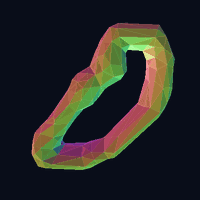
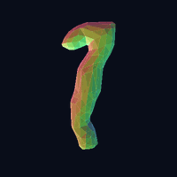
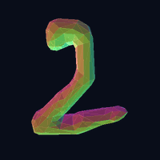
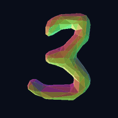
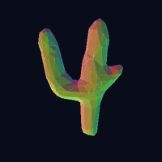
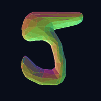
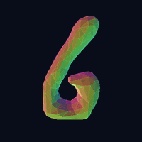
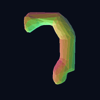
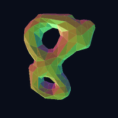
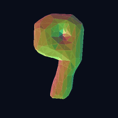

# Digit3D: 3D Multimodal MNIST Benchmark

[](https://opensource.org/licenses/MIT)
[](https://www.python.org/downloads/)
[](https://pytorch.org/)
[](https://khoidoo.github.io/digit3d/)

**Digit3D** is a lightweight, watertight 3D multimodal benchmark extending the classic MNIST dataset into 3D Computer Vision and Geometric AI. It provides 70,000 paired watertight `.obj` meshes, oriented 6D point clouds with surface normals ($[N, 6]$), and $28 \times 28$ grayscale source images for rapid algorithm prototyping, representation learning, and 3D generative modeling.

---

## 3D Watertight Mesh Modalities (Digits 0–9)

| **Digit 0** | **Digit 1** | **Digit 2** | **Digit 3** | **Digit 4** |
|:---:|:---:|:---:|:---:|:---:|
|  |  |  |  |  |
| **Digit 5** | **Digit 6** | **Digit 7** | **Digit 8** | **Digit 9** |
|  |  |  |  |  |

---

## Core Benefits of Digit3D

- ⚡ **Ultra-Fast Prototyping**: Train state-of-the-art 3D point cloud classifiers (~99% accuracy) and continuous normalizing flows in under 10–30 minutes on a single consumer GPU.
- 🔄 **Multimodal 2D $\longleftrightarrow$ 3D Alignment**: Direct 1-to-1 pairing between 2D images ($28 \times 28$), watertight 3D meshes (~500 faces), and oriented 6D point clouds ($[N, 6]$) for image-to-3D, point cloud generation, and cross-modal learning.
- 📦 **Zero-Extraction Dataset Streaming**: Native PyTorch dataset classes stream assets directly from compressed zip archives into memory, eliminating disk extraction and filesystem inode exhaustion.
- 🎯 **Clean Watertight Topology**: Every 3D mesh is constructed with distance field extrusions, Taubin smoothing, and surface decimation, ensuring consistent outward face normals and zero topological degeneracies.
- 🧪 **Comprehensive Generative & Discriminative Baselines**: Established benchmark suites for Point Cloud Classification, Continuous Flow Matching (Rectified Flow, Mean Flow, SoFlow), Multi-Scale / Arbitrary-Resolution Synthesis, Point Cloud Inpainting, and Two-Stage Watertight Mesh Generation.

---

## Repository Structure

```text
digit3d/
├── data/                               # Dataset construction & generation pipeline
│   ├── construct.py                   # 2D MNIST -> 3D .obj mesh & .png construction
│   ├── render_dataset_mesh_gifs.py    # 3D spinning mesh animation generator
│   └── run.sh                         # Complete dataset construction script
│
├── docs/                               # Interactive multi-page documentation platform
│   ├── index.html                     # Benchmark overview & project showcase
│   ├── unconditional.html             # Unconditional Point Cloud Generation
│   ├── class_conditional.html         # Class-Conditional Point Cloud Generation
│   ├── image_conditional.html         # Image-Conditional Point Cloud Generation
│   ├── arbitrary_pc_generation.html   # Arbitrary-Resolution Multi-Scale Generation
│   ├── sparse_reconstruction.html     # Sparse Voxel VAE Reconstruction
│   ├── sparse_generation.html         # Image-Conditional Mesh Generation
│   ├── pccond_mesh_generation.html    # PointCloud-Conditional Mesh Generation
│   ├── limitations.html               # Technical analysis & future roadmap
│   └── static/gifs/                   # 3D spinning mesh & trajectory animations
│
└── experiments/
    ├── pc/                            # Point Cloud experiments
    │   ├── classification/            # 3D Point Cloud classification benchmark
    │   │   ├── models.py              # PointTransformerCls model definition
    │   │   ├── train.py               # Classification training script
    │   │   ├── eval.py                # Evaluation & misclassified case export (.ply + .png)
    │   │   └── eval_results.json      # Benchmark metrics & per-class breakdown
    │   │
    │   ├── generation/                # Continuous flow generative modeling
    │   │   ├── transformer.py         # PointTransformer, ClassConditioned, ImgConditionPointTransformer
    │   │   ├── train.py               # RectifiedFlow, MeanFlow, SoFlow training
    │   │   ├── generation.py          # Image-conditioned & class-conditioned 3D sampling
    │   │   ├── interpolation.py       # Latent shape morphing & class interpolation
    │   │   ├── record_trajectory_video.py # ODE continuous flow trajectory GIF recorder
    │   │   ├── fid.py                 # Fréchet Distance evaluation for 3D point clouds
    │   │   └── checkpoint.py          # Memory-efficient gradient checkpointing
    │   │
    │   ├── arbitrary_generation/      # Multi-scale arbitrary point cloud synthesis
    │   │   ├── transformer.py         # Continuous multi-resolution PointTransformer
    │   │   ├── train.py               # Arbitrary point density training pipeline
    │   │   ├── checkpoint.py          # Model checkpoint management
    │   │   ├── fid.py                 # Multi-scale Chamfer Distance & FID evaluation
    │   │   └── interpolation.py       # Resolution and class latent interpolation
    │   │
    │   └── inpainting/                # Point cloud inpainting & surface completion
    │       ├── train.py               # Partial point cloud completion flow training
    │       ├── eval.py                # Inpainting Chamfer Distance evaluation
    │       └── models.py              # PointInpaintingTransformer
    │
    ├── sparse_voxel/                  # Sparse Voxel experiments
    │   ├── classification/            # Sparse Voxel ResNet classification benchmark
    │   │   ├── models.py              # SparseClassifier architecture
    │   │   ├── train.py               # Classification training script
    │   │   ├── eval.py                # Evaluation & error analysis
    │   │   └── eval_results.json      # Benchmark metrics & per-class breakdown
    │   │
    │   ├── reconstruction/            # Sparse Voxel VAE 3D reconstruction
    │   │   ├── models.py              # SimpleSparseVAE architecture
    │   │   ├── train.py               # VAE reconstruction training script
    │   │   ├── generation.py          # 3D Mesh reconstruction & sample export
    │   │   └── eval.py                # Reconstruction evaluation (Chamfer Distance)
    │   │
    │   ├── generation/                # Two-Stage Image-to-Mesh Generation
    │   │   ├── stage1/                # Structure DiT MeanFlow (Active Voxels)
    │   │   └── stage2/                # Sparse Vertex SDF Rectified Flow (Watertight Mesh)
    │   │
    │   └── pccond_generation/         # Two-Stage PointCloud-to-Mesh Generation
    │       ├── stage1/                # Point-Conditioned Structure DiT
    │       └── stage2/                # Point-Conditioned Sparse Vertex SDF
    │
    └── render_experiment_videos.py    # Multi-panel 3D experiment video rendering engine
```

---

## 1. Dataset Generation Pipeline

To construct the complete 70,000-sample dataset:

```bash
cd data/
bash run.sh
```

### Construction Details:
1. **Mesh Construction (`construct.py`)**:
   Downloads MNIST via `torchvision`, computes 2D distance transforms, applies spherical parabolic thickness along the $Z$-axis, extracts isosurfaces via Marching Cubes, smooths with a Taubin filter, and decimates to ~500 triangles. Saves 70,000 paired `.obj` meshes and `.png` images into `src/`.
2. **Streaming Archiving**: Compresses `src/` into `digit3d.zip`.

---

## 2. Dataset Streaming in PyTorch

The dataset classes stream assets directly from zip archives without requiring manual extraction on disk:

```python
from conquer3d.data.dataset.digit3d import Digit3D, PointDigit3D

# 1. Point Cloud Dataset (XYZ + Surface Normals + Optional Paired Image)
point_dataset = PointDigit3D(
    root="~/.conquer3d/",
    train=True,
    download=True,
    num_points=512,
    return_img=True
)
points, features, label, img = point_dataset[0]
# points:   [512, 3] (XYZ coordinates)
# features: [512, 6] (XYZ + NxNyNz oriented normals)
# label:    int (0-9)
# img:      [1, 28, 28] (Tensor in [0, 1])

# 2. Watertight 3D Mesh Dataset (Vertices & Triangular Faces)
mesh_dataset = Digit3D(root="~/.conquer3d/", train=False, download=True, return_img=True)
vertices, faces, label, img = mesh_dataset[0]
# vertices: [V, 3] (3D vertex coordinates)
# faces:    [F, 3] (Triangular face indices)
# label:    int (0-9)
```

---

## 3. Point Cloud Classification Benchmark

The classification pipeline trains and evaluates a `PointTransformerCls` (depth=4, in_channels=6, dim=128, share_planes=8, patch_size=32) on 10-class point cloud digit recognition.

### Training:
```bash
python experiments/pc/classification/train.py --epochs 100 --batch_size 32
```

### Evaluation & Error Case Export:
```bash
python experiments/pc/classification/eval.py
```
- **Accuracy**: **~98.95%** on the 10,000-sample test set.
- **Misclassification Export**: Automatically identifies misclassified test samples and saves paired 2D images (`.png`) and 3D point clouds with normals (`.ply`) to `experiments/pc/classification/wrong/` for error analysis.

---

## 4. 3D Generative Modeling & Continuous Flows

The generative suite implements continuous normalizing flows on 3D point clouds with surface normals.

### Generative Algorithms (`--mode`):
- `--mode 0`: **Rectified Flow** (Continuous straight-path flow matching)
- `--mode 1`: **Mean Flow** (Fast velocity matching with `torch.func.jvp`)
- `--mode 2`: **SoFlow** (1-step generative flow model)

---

### A. Training Generative Models

#### 1. Image-Conditioned Generation (2D Image $\to$ 3D Point Cloud):
```bash
# Rectified Flow
python experiments/pc/generation/train.py --mode 0 --img_cond --epochs 200 --batch_size 32

# Mean Flow
python experiments/pc/generation/train.py --mode 1 --img_cond --epochs 200 --batch_size 32

# SoFlow (1-step generator)
python experiments/pc/generation/train.py --mode 2 --img_cond --epochs 200 --batch_size 32
```

#### 2. Class-Conditioned Generation (Class ID $\to$ 3D Point Cloud):
```bash
python experiments/pc/generation/train.py --mode 0 --class_cond --epochs 200 --batch_size 32
```

#### 3. Unconditional Generation:
```bash
python experiments/pc/generation/train.py --mode 0 --epochs 200 --batch_size 32
```

---

### B. Inference & Sampling (`generation.py`)

#### 1. Generate 3D Point Cloud from a Custom 2D Image File:
Pass any 2D image file (`.png`, `.jpg`, etc.). The script automatically resizes/normalizes it to $1 \times 28 \times 28$:
```bash
python experiments/pc/generation/generation.py \
    --img_cond \
    --img_path /path/to/my_digit.png \
    --num_samples 5 \
    --cfg_scale 2.0
```

#### 2. Generate Conditioned on a Specific Digit Class from the Dataset:
```bash
python experiments/pc/generation/generation.py \
    --img_cond \
    --class_label 7 \
    --num_samples 10 \
    --cfg_scale 1.5
```

#### 3. Record Continuous Flow ODE Trajectory Animation (`record_trajectory_video.py`):
```bash
python experiments/pc/generation/record_trajectory_video.py \
    --img_path docs/data/img_cond/sample_004_class_0_input.png \
    --steps 50 \
    --output_gif experiments/pc/generation/image_conditional_trajectory.gif
```

---

### C. Continuous Latent Class Interpolation (`interpolation.py`)

Morph continuously between any two digit classes ($A \to B$) through the unconditional latent flow:

```bash
python experiments/pc/generation/interpolation.py \
    --mode 0 \
    --class_start 0 \
    --class_end 8 \
    --k 10 \
    --steps 64 \
    --noise_strength 1.0
```

---

### D. Generative Quality Evaluation (`fid.py`)

Evaluate generative sample quality using 3D point cloud Fréchet Inception Distance (FID):

```bash
python experiments/pc/generation/fid.py --mode 0 --class_cond --batch_size 500
```

---

## 5. 3D Visualization

All generated `.ply` and `.obj` files can be directly inspected in standard 3D viewers such as **MeshLab**, **CloudCompare**, **Blender**, or through the interactive web platform at [`docs/index.html`](https://khoidoo.github.io/digit3d/).

---

## References

- **Point-E (OpenAI)**: *Point-E: A System for Generating 3D Point Clouds from Complex Prompts*. Alex Nichol, Heewoo Jun, Prafulla Dhariwal, Pamela Mishkin, Mark Chen. [arXiv:2212.08751](https://arxiv.org/abs/2212.08751) | [GitHub](https://github.com/openai/point-e)
- **Rectified Flow**: *Flow Straight and Fast: Learning to Generate and Transfer Data with Rectified Flow*. Xingchao Liu, Chengyue Gong, Qiang Liu. [arXiv:2209.03003](https://arxiv.org/abs/2209.03003) | [rectified-flow-pytorch](https://github.com/lucidrains/rectified-flow-pytorch)
- **Point Transformer**: *Point Transformer*. Hengshuang Zhao, Li Jiang, Jiaya Jia, Philip Torr, Vladlen Koltun. [arXiv:2012.09164](https://arxiv.org/abs/2012.09164)
- **Classifier-Free Guidance**: *Classifier-Free Diffusion Guidance*. Jonathan Ho, Tim Salimans. [arXiv:2207.12598](https://arxiv.org/abs/2207.12598)
- **Conquer3D**: *Differentiable 3D Geometry and Fast GPU Spatial Acceleration Engine*. [GitHub](https://github.com/KhoiDOO/conquer3d)
